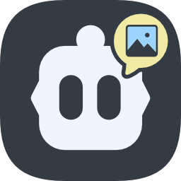

<div align="center">

<p align="center">
  
</p>

# Cline Cubed

</div>
<div align="left">

Want to have multiple Cline chats running at the same time? **Get Cline Cubed!**

Want to use affordable text-only models for Plan mode and Act mode, yet still paste
an image and have your chat understand it? **Get Cline Cubed!**

Cline Cubed adds a third model channel — **Image Mode**. When you add an image to a
prompt or reply and your Plan/Act model can't see images, the image is routed to your
Image Mode model first and its description is added to your prompt as text. And you
can run multiple chat sessions at once, each with its own conversation.

If you love Cline but want more of it, get Cline Cubed.

---

A fork of [Cline](https://github.com/cline/cline) that adds a third **Image Mode**
model channel. When you paste an image into a chat running a non-vision model
(e.g. DeepSeek Reasoner), your configured Image Mode vision model describes the
image, and that description is bridged into the chat as a collapsible text block —
so non-vision models get full image context without ever receiving raw image bytes.

**Fork maintainer:** [Doug Joseph](https://github.com/DougJoseph)

</div>
<div align="left">

## What's different from Cline

- **Three model channels — Plan, Act, and Image Mode.** Each tab in API
  Configuration keeps its own provider, model, API key, and reasoning effort.
  Image Mode is the vision channel used when an image is pasted into a chat.
- **Image bridge** — images are intercepted at send, described by the Image Mode
  vision model, and rolled up as a selectable/copyable text block; the reasoning
  model never sees the raw image bytes.
- **Capability-aware** — the bridge runs only when the active Plan/Act model is
  non-vision (or its capability is unknown); a vision-capable Plan/Act model
  receives the raw image as usual.
- **Image bridge debug logging** — a Settings toggle records each bridge call
  (provider, model, URL, image type/size, auth, status) to the VS Code output
  channel and shows the most recent calls inline under failed bridge blocks, with
  a one-click toggle right in the chat. On failure the panel appears even when
  the toggle is off.
- **Fork identity** — the About panel, extension manifest, and marketplace README
  are the fork's own: `DougJoseph.cline-cubed`, "Cline Cubed".
- **Three New Chat buttons (mirrors Claude Code), every one a real chat panel** — in the
  chats list's toolbar, the editor title bar, and the secondary-sidebar chat header. Each one
  opens or creates a chat **in the location chosen in Settings**. When the target area has
  **no chat**, you get the **"What can I do for you?"** home — a chat whose default is also
  the history chooser (recent chats, plus the prompt input at the bottom to start a new
  task). When a chat is **already there**, a **new, independent chat** opens beside it and
  the existing one keeps running, untouched. (The left activity-bar icon itself opens the
  chats list — see below.)
- **Multiple chat sessions side by side** — each chat is keyed to its own conversation, so
  several run at once and each shows its own work. The sidebar hosts one chat at full height;
  further chats open as editor tabs, which you can arrange side by side. A chat lives in one
  place: open it somewhere else and it moves there, with its old spot returning to the home.
- **Every chat owns its own busy state** — each one shows its own thinking indicator while it
  works and its own Cancel button, from its very first response onward. Cancelling one chat
  stops that chat and leaves every other chat running.
- **"Where new chat sessions open" setting** — choose where a new chat lands: **Editor area**
  (new tab — the default) or **Secondary sidebar** (typically right). Every chat button
  follows it; chats already open stay where they are. A sidebar holds one chat, so further
  chats open as editor tabs whichever you pick. Get Started offers the same choice, and a
  gear button in the chat input row opens Settings.
- **Gear button in the chat input row** — restores the settings affordance stock Cline
  removed from the VS Code panel.
- **Chats in one group, files in another** — every chat opened in the editor area gathers
  as a tab in ONE locked group, so you slide the tab strip between conversations exactly as
  you would between files, and nothing can drop a file on top of the chat you are reading.
  Files Cline Cubed opens go elsewhere by design: never the chats group, and never a group
  holding another extension's chat panel — if only chat panels are open, it makes a fresh
  group for your files rather than intruding on anybody's conversation.
- **No tab clutter** — an edited file appears in a preview tab, the italic one VS Code
  replaces in place, so a session that edits ten files leaves one tab rather than ten. A tab
  you opened yourself is never closed and never converted.
- **Chats survive a reload — and a reinstall** — every editor tab comes back with its own
  conversation and the docked sidebar chat with its own, including chats you opened from your
  history. The record rides in VS Code's own workspace storage, so it outlasts far more than
  a restart.
- **Every message stamped with its time** — a quiet `5:23 PM` floated at the right of a
  message's first line, rendered locally in your own timezone at no token cost. Hover expands
  it to the full `Aug 30, 2026, 5:23:12.179 PM`; every copy carries that full stamp plus an
  invisible `User:` / `AI:` marker, so a pasted conversation reads correctly anywhere. A
  reopened chat shows its messages' TRUE original times.
- **Prompt history in the chat box** — `↑` brings back what you typed before, most recent
  first, and `↓` walks back down, per chat. A draft already in the box is preserved and handed
  back on the way down, and multi-line editing keeps its arrows.
- **It knows what it is** — ask, and it can name the fork, its Marketplace listing and its
  repository, and it knows where its own transcripts live well enough to answer questions
  about your chat history — asking first, since those files sit outside your project.
- **A chats list in the activity bar** — the left icon opens a list of your chats rather than
  a chat: the ones open right now at the top, each labelled with where it is, then the full
  history. A New Chat button sits above them, and Settings, Account, and Marketplace open
  right there in the panel instead of commandeering one of your running chats.
- **Redesigned history rows** — clicking a row opens that chat, and if that chat is already
  open somewhere it is brought into view where it already lives rather than moved: the panel
  it is running in comes forward, a brief notice says it was already open, and the panel you
  clicked in is left exactly as it was. A chat that is open nowhere opens in the surface you
  clicked from when that surface is an empty home, and in a new editor tab when it is already
  showing a chat — so clicking three chats gives three windows, and the chat you are working
  in is never taken from you. The per-row controls (details, favorite, delete) appear on hover at the
  right. No checkbox column, no full-width red delete
  button — clearing the whole history is one quiet control under the list. The chats list and
  the in-chat history panel are the same component, so both behave identically.
- **Even editor widths** — opening a chat into a new editor column evens the column widths, so
  a new chat never arrives as a sliver beside a wide one.
- **Name your chats** — every chat is displayed by its first prompt until you give it a name of
  its own. Hover the name at the top of a chat, or anywhere on a row in the chats list or
  history, and a pencil appears; click either to edit in place. Enter or clicking away commits,
  Escape cancels, clearing the box restores the first prompt. Renaming never rewrites what you
  actually typed — the name is a field of its own and the first prompt stays intact in the
  chat's expanded details. The name shows everywhere the chat is listed, and fuzzy search
  matches it as well as the prompt.
- **Editor tabs are named after their chat** — a tab carries its chat's name, or its first
  prompt if you have not renamed it, so several open chats are distinguishable instead of a row
  of identical tabs. Long prompts are shortened to fit the tab strip; a tab with no chat in it
  yet reads "Cline Cubed". Tabs keep up on their own — a new chat's tab takes its name as soon
  as the first prompt lands, a rename relabels it at once, and closing the chat inside a tab
  returns it to "Cline Cubed".

## Install

Install the built `.vsix` in VS Code: Extensions → ⋯ menu → **Install from
VSIX…** → pick `cline-cubed-<ver>.vsix`. It installs alongside stock Cline as a
distinct extension (`DougJoseph.cline-cubed`); the two coexist.

## Build

From `apps/vscode/`:

```sh
bun run package
bunx @vscode/vsce package --no-dependencies --allow-package-secrets sendgrid --out cline-cubed-<ver>.vsix
```

Note: if your `bun` is an Intel (x86_64) build running under Rosetta on an
arm64 Mac, it can crash during the build — install the native arm64 `bun` and
put it first in PATH.

The canonical release path is the README swap-in → `vsce package` → README
restore sequence in `.github/workflows/ext-vscode-publish-stable.yml`.

Everything else is unchanged Cline functionality. Upstream documentation follows.

</div>

---

<p align="center">
  
</p>

<h1 align="center">Cline</h1>

<p align="center">
The open source coding agent in your IDE and terminal.
</p>

<div align="center">

<div align="center">
<table>
<tbody>
<td align="center">
<a href="https://docs.cline.bot" target="_blank"><strong>Docs</strong></a>
</td>
<td align="center">
<a href="https://discord.gg/cline" target="_blank"><strong>Discord</strong></a>
</td>
<td align="center">
<a href="https://www.reddit.com/r/cline/" target="_blank"><strong>r/cline</strong></a>
</td>
<td align="center">
<a href="https://github.com/cline/cline/discussions/categories/feature-requests?discussions_q=is%3Aopen+category%3A%22Feature+Requests%22+sort%3Atop" target="_blank"><strong>Feature Requests</strong></a>
</td>
<td align="center">
<a href="https://cline.bot/join-us" target="_blank"><strong>Join us!</strong></a>
</td>
</tbody>
</table>
</div>

</div>

<br>

<div align="center">
<table>
<tr>
<td align="center" width="50%">

### CLI

Run Cline in your terminal.
Interactive chat or fully headless
for CI/CD and scripting.

```
npm i -g cline
```

<a href="./apps/cli/README.md">Learn more</a>
<br><br>

</td>
<td align="center" width="50%">

### Kanban

Run many agents in parallel from a
web-based task board. Each card gets its own
worktree, auto-commit, and dependency chains.

```
npm i -g kanban
```

<a href="https://github.com/cline/kanban">Learn more</a>
<br><br>

</td>
</tr>
<tr>
<td align="center" width="50%">

### VS Code Extension

AI coding assistant in your editor.
Create files, run commands, browse the web,
and use tools with human-in-the-loop approval.

<a href="https://marketplace.visualstudio.com/items?itemName=saoudrizwan.claude-dev">Install from VS Marketplace</a>
<br><br>

</td>
<td align="center" width="50%">

### JetBrains Plugin

The same Cline experience in IntelliJ IDEA,
PyCharm, WebStorm, GoLand, and the rest of
the JetBrains family.

<a href="https://plugins.jetbrains.com/plugin/28247-cline">Install from JetBrains Marketplace</a>
<br><br>

</td>
</tr>
</table>
</div>

<div align="center">
<table>
<tr>
<td align="center">

### SDK

Build your own AI agents and integrations powered by the same engine that runs the CLI, Kanban, VS Code extension, and JetBrains plugin. Custom tools, multi-agent teams, connectors, scheduled automations, and more.

```
npm install @cline/sdk
```

<a href="https://docs.cline.bot/cline-sdk/overview">Documentation</a>
<br><br>

</td>
</tr>
</table>
</div>

---

## Index

| Product | Description | Location | CHANGELOG |
|---------|------------|--------------|--------------|
| **SDK** | Node.js programmatic agent API and extension exports. | [`sdk/`](https://github.com/cline/cline/tree/main/sdk) | [CHANGELOG.md](https://github.com/cline/cline/blob/main/sdk/CHANGELOG.md) |
| **CLI** | Terminal UI, headless mode, shell commands, and CLI-specific flows. | [`apps/cli/`](https://github.com/cline/cline/tree/main/apps/cli) | [CHANGELOG.md](https://github.com/cline/cline/blob/main/apps/cli/CHANGELOG.md) |
| **VS Code Extension** | The Marketplace extension and extension host integration. | [`/`](https://github.com/cline/cline/tree/main) (WIP migrating) | [CHANGELOG.md](https://github.com/cline/cline/blob/main/CHANGELOG.md) |
| **JetBrains Plugin** | JetBrains-hosted client that talks to the shared agent core. | Currently we are not open-sourcing JetBrains plugins | - |
| **Kanban** | Web-based multi-agent task board. | [`cline/kanban`](https://github.com/cline/kanban) | [CHANGELOG.md](https://github.com/cline/kanban/blob/main/CHANGELOG.md) |
| **Docs site** | Public documentation pages. | [`docs/`](https://docs.cline.bot/) | - |

## Edits Code Across Your Project

Cline reads your project structure, understands the relationships between files, and makes coordinated changes across your codebase. It monitors linter and compiler errors as it works, fixing issues like missing imports, type mismatches, and syntax errors before you even see them. In VS Code and JetBrains, every edit shows up as a diff you can review, modify, or revert. All changes are tracked with checkpoints, so you can easily undo the agent's work.

## Runs Bash Commands

Cline executes commands directly in your terminal and watches the output in real time. Install packages, run build scripts, execute tests, deploy applications, manage databases. For long-running processes like dev servers, Cline continues working in the background and reacts to new output as it appears, catching compile errors, test failures, and server crashes as they happen.

## Plan and Act

Toggle between Plan mode and Act mode. In Plan mode, Cline explores your codebase, asks clarifying questions, and lays out a strategy. Once you're aligned, switch to Act mode and Cline executes the plan. Every file edit and terminal command requires your approval, so you stay in control of what actually changes. Or toggle auto-approve and let Cline run autonomously.

## Rules and Skills

Define project-specific rules in `.clinerules` files that guide how Cline works in your codebase: coding standards, architecture conventions, deployment procedures, testing requirements. Rules are picked up automatically by the CLI, VS Code extension, and JetBrains plugin. Use skills to let the model load specific rules when needed.

## Works With Every Model

Cline is not locked to a single AI provider. Use whichever model fits your workflow:

| Provider | Models |
|----------|--------|
| Anthropic | Claude Opus, Sonnet, Haiku |
| OpenAI | GPT series models |
| Google | Gemini series models |
| OpenRouter | 200+ models from any provider |
| Vercel AI Gateway | Route to many providers through one gateway |
| AWS Bedrock | Claude, Llama, and more |
| Azure / GCP Vertex | All hosted models |
| Cerebras / Groq | Fast inference models |
| Ollama / LM Studio | Run local models on your machine |
| Any OpenAI-compatible API | Self-hosted or third-party endpoints |

## Extend With Plugins or MCP Servers

Extend Cline's capabilities with plugins. Using the SDK, register tools and lifecycle hooks programmatically through the plugin system for logging, auditing, policy enforcement, or adding domain-specific capabilities. Simple plugin example below.

```typescript
import { Agent, createTool } from "@cline/sdk"

const deployTool = createTool({
  name: "deploy",
  description: "Deploy the current branch to staging.",
  inputSchema: { type: "object", properties: { env: { type: "string" } }, required: ["env"] },
  execute: async (input) => {
    // your deployment logic
  },
})

const agent = new Agent({ tools: [deployTool], /* ... */ })
```
...or use [MCP servers](https://github.com/modelcontextprotocol) to connect to databases, query APIs, manage cloud infrastructure, and interact with external systems. Use [community-built servers](https://github.com/modelcontextprotocol/servers) or ask Cline to create custom tools on the fly. In the CLI, manage servers with `cline mcp`.

## Multi-Agent Teams

Coordinate multiple agents working together on complex tasks. A coordinator agent breaks the work into subtasks and delegates to specialist agents, each with their own tools and context. Team state persists across sessions so you can pick up where you left off.

```bash
cline --team-name auth-sprint "Plan and implement user authentication with tests"
```

## Scheduled Agents

Run agents on cron schedules for recurring automations. Daily PR summaries, weekly dependency checks, codebase health reports. Schedules persist across restarts and run independently of any terminal session.

```bash
cline schedule create "PR summary" \
  --cron "0 9 * * MON-FRI" \
  --prompt "List all open PRs and their review status" \
  --workspace /path/to/repo
```

## Connect to Slack, Telegram, Discord, and More

Chat with your agent from any messaging platform: Telegram, Slack, Discord, Google Chat, WhatsApp, and Linear. Each conversation thread maps to an agent session with full context. Set up access control to restrict who can interact with your agent.

```bash
# Connect to Telegram
cline connect telegram -k $BOT_TOKEN
# Connect to Slack through webhook
cline connect slack --bot-token $SLACK_TOKEN --signing-secret $SECRET --base-url $URL
# Connect to Slack using socket mode
cline connect slack --bot-token $SLACK_TOKEN --app-token $SLACK_APP_TOKEN
```

## Headless CLI for CI/CD

Run Cline with zero interaction for scripting and automation. Pipe input, get JSON output, chain commands, integrate into CI/CD pipelines.

```bash
cline "Run tests and fix any failures"
git diff origin/main | cline "Review these changes for issues"
cline --json "List all TODO comments" | jq -r 'select(.type == "agent_event" and .event.text) | .event.text'
```

## Contributing

Start with the [Contributing Guide](CONTRIBUTING.md). Join our [Discord](https://discord.gg/cline) and head to the `#contributors` channel to connect with other contributors. Check our [careers page](https://cline.bot/join-us) for full-time roles.

## License

[Apache 2.0 © 2026 Cline Bot Inc.](./LICENSE)
